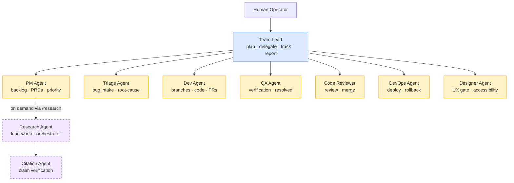
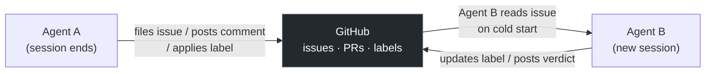
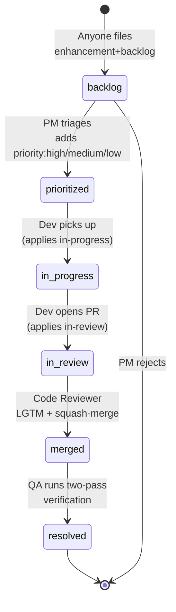
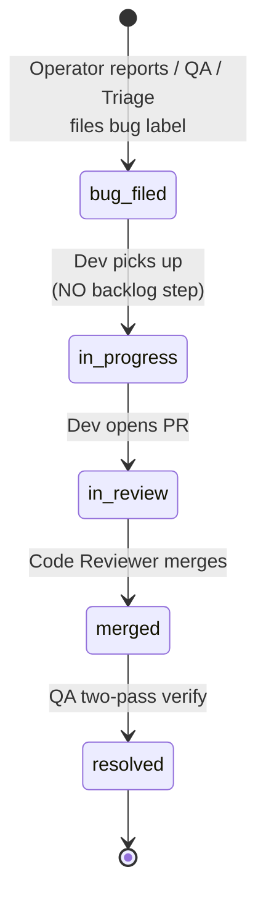
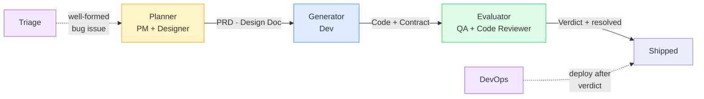
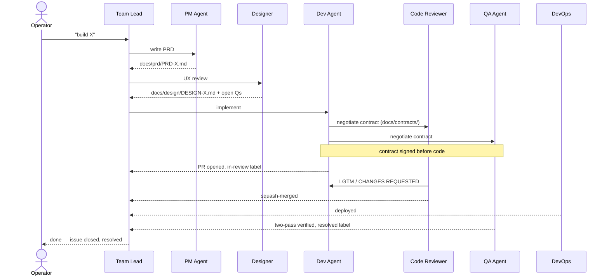
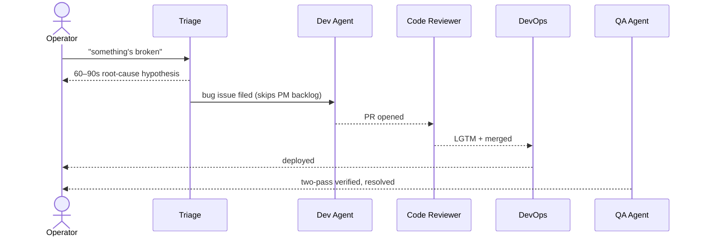

# claude-workflow

A Claude Code multi-agent engineering team — ready to drop into any project.

You set a goal. The team executes: PM writes the spec, Dev builds it, QA verifies it, Code Reviewer merges it, DevOps ships it. **GitHub issues and PRs are the single source of truth** — agents coordinate through durable GitHub state, not ephemeral chat.

Derived from the [full Anthropic engineering blog corpus](https://www.anthropic.com/engineering). Deliberately small and free of project-specific content. Customize once, ship many.

---

## Quick start

```bash
# 1. Clone into a new project (or copy .claude/ + top-level docs into an existing one)
git clone https://github.com/cvsubs74/claude-workflow.git my-new-product
cd my-new-product
rm -rf .git && git init -b main

# 2. THE first command — interactive scaffold setup
./bin/init-project.sh
```

`bin/init-project.sh` fills in `{{PROJECT_NAME}}` / `{{GITHUB_REPO}}` / `{{DEFAULT_BRANCH}}` / test+lint+dev+deploy commands across CLAUDE.md and the agent files, sanity-checks all 30+ scaffolds, and creates a stub `bin/init.sh`. ~30 seconds of typing.

Because you wiped the template's git history in step 1, there is no `origin` remote — and the whole team workflow coordinates through GitHub issues and PRs. So the script also offers to **create your GitHub repo, set `origin`, push the initial commit, and bootstrap the labels**. This needs the `gh` CLI authenticated first:

```bash
gh auth login   # one-time, if you haven't already
```

If `gh` isn't installed, the script prints the exact `gh repo create …` command to run yourself.

```bash
# 3. Open Claude Code and spawn the team
claude
/onboard-team
```

Spawns Team Lead + 7 always-on specialists. Team Lead reads `CLAUDE.md`, anchors on `memory/PROGRESS.md`, and asks for the first goal.

### Your first goal

| If you have a **fuzzy idea** | If you have a **concrete spec** |
|---|---|
| `/office-hours` first — six forcing questions surface the real problem before anyone writes a PRD | Brief the Team Lead directly; they route to PM for the PRD, then PM/Designer + Dev + QA negotiate `docs/contracts/<N>-<slug>.md` |

### Validate the system before committing to a real feature

```
/heartbeat
```

Ships a one-digit canary change through PM → Dev → CR and confirms all four exit-state criteria pass. ~2 minutes; emits PASS / PARTIAL / FAIL.

**TL;DR**: `./bin/init-project.sh` → `claude` → `/onboard-team`.

---

## Agent topology

Ten agents total: **8 always-on** (Team Lead + 7 specialists) plus **2 on-demand** (Research, Citation).



| Agent | Role |
|---|---|
| **Team Lead** | Goal decomposition, cross-agent delegation, status synthesis. Owns no labels. Not a specialist. |
| **PM** | Backlog triage, PRDs, slicing features into issues, `prioritized` + `priority:*` labels. |
| **Triage** | Operator bug intake, 60–90s root-cause hypothesis, post-merge operator verification. |
| **Dev** | Code, branches, PRs, design docs, `in-progress` + `in-review` labels. |
| **QA** | Bug discovery, post-merge verification (two-pass), `resolved` label, test coverage. |
| **Code Reviewer** | PR review verdict, squash-merge via `bin/merge-pr.sh`, cross-flow contract enforcement. |
| **DevOps** | Deploys, secrets, infrastructure health checks, rollback. |
| **Designer** | PRD UX review (mockups + open questions), frontend PR visual quality gate, accessibility. |
| **Research** | On-demand lead-worker for breadth-first discovery (spawned via `/research`). |
| **Citation** | Verifies research claims to source; emits READY_TO_SHIP or NEEDS_REVISION. |

Each role's full contract lives in `.claude/agents/<role>-agent.md`. You can delete agents you don't need — the team degrades gracefully.

---

## How agents communicate

Agents communicate through two mechanisms — and crucially, **all durable coordination happens through GitHub**, not through chat history that disappears.

### Mechanism 1: spawn a fresh specialist

```
Team Lead calls Agent(subagent_type: "pm")
  → a new PM Agent session starts
  → reads its agent file + memory + the GitHub issue
  → does its work
  → writes output to a file / GitHub comment
  → exits
```

### Mechanism 2: send a message to a running specialist

```
Team Lead calls SendMessage(agent_id: "dev-session-42", message: "please address CR feedback")
  → the running Dev session receives the message mid-task
  → pivots without losing its current context
```

### Why GitHub is the coordination layer

Each agent session starts cold — it has no memory of previous sessions' chat. The team stays coherent because every status transition, decision, and handoff is recorded in GitHub:



This means:
- A PM session that triages 10 issues can end. When Dev picks up work next session, it reads the `prioritized` label from GitHub — no handoff message needed.
- A Code Reviewer that posts "CHANGES REQUESTED" on a PR captures that verdict durably. Dev reads it on its next session without needing anyone to repeat it.
- A DevOps deploy failure that pings the issue creates a permanent record the operator can read hours later.

**Rule:** Plans live in operator messages (ephemeral). Status lives on issues, PRs, and labels (durable). Never create parallel tracking surfaces.

---

## How agents coordinate on GitHub issues

Issues flow through a predictable label lifecycle. Each label transition has a single owner.

### Feature / enhancement lifecycle



### Bug fast-path (skips PM triage)



### Label ownership — who can apply what

| Label | Owner | Applied when |
|---|---|---|
| `bug` | QA / Triage / Dev / Operator | Regression or breakage confirmed. Skips backlog. |
| `enhancement` | Anyone | New feature, refactor, cleanup, tooling. |
| `backlog` | Filer | Default state for any new enhancement. Removed only by PM. |
| `prioritized` | **PM only** | PM triaged and approved for Dev pickup. Always paired with `priority:*`. |
| `priority:high` | **PM only** | Blocks operator workflow or required precondition. |
| `priority:medium` | **PM only** | Clear value, no active blocker. Safe default. |
| `priority:low` | **PM only** | Cleanup, polish, nice-to-have. |
| `in-progress` | **Dev only** | Dev started work. Apply on issue pickup. |
| `in-review` | **Dev only** | PR open, awaiting Code Reviewer. Hook-enforced. |
| `resolved` | **QA only** | QA verified post-merge (two consecutive passes). Terminal state. |

Four hard rules:
1. Bugs NEVER enter the backlog.
2. Only PM applies `prioritized` + `priority:*`.
3. Only QA applies `resolved`.
4. Only Dev applies `in-progress` + `in-review`.

---

## The operating model

### Planner / Generator / Evaluator

The 8-agent team maps directly onto the [Anthropic harness pattern](https://www.anthropic.com/engineering/harness-design-long-running-apps) — three roles with file-based handoffs between every pair:



Every handoff is a named file artifact — no invisible context passing:

| Handoff | Artifact | Location |
|---|---|---|
| Planner → Generator | PRD + Design Doc | `docs/prd/` · `docs/design/` |
| Generator ↔ Evaluator | Sprint contract | `docs/contracts/<N>-<slug>.md` |
| Generator → Evaluator | Code on branch | PR diff |
| Evaluator verdict | PR comment + label | `resolved` on issue |

### Feature pipeline (end to end)



### Bug pipeline (fast-path)



### Gate rules — when PRD + Design Doc are required

| Change type | PRD required | Design Doc required | Contract required |
|---|---|---|---|
| New user-facing feature | Yes | Yes | Yes |
| Refactor with behavior change | Yes | Yes | Yes |
| Refactor, no behavior change | No | Optional | Optional |
| Bug fix | No | No | No |
| Chore / tooling / dep upgrade | No | No | No |
| Hotfix | No | No | No |

Skipping the gate without explicit operator override blocks the PR at review.

---

## Slash commands

| Command | What it does |
|---|---|
| `/onboard-team` | Spawn Team Lead + 7 always-on specialists |
| `/office-hours` | Six forcing questions before writing code — surfaces the real problem |
| `/plan-review` | Run CEO / engineering / design review lenses on a plan or design doc |
| `/investigate` | Systematic root-cause debugging. No fixes without an investigation. |
| `/ship` | Sync, run tests, push, open a PR (manual fallback for Dev/CR loop) |
| `/retro` | Weekly retro — shipping streaks, test health, growth opportunities |
| `/heartbeat` | Live SDLC dry-run: canary through PM → Dev → CR; emits PASS/PARTIAL/FAIL |
| `/eval` | Run eval suite; report per-cohort pass rate + regressions |
| `/swarm <oracle> <N>` | Dispatch N parallel Dev sessions for partitionable bulk work |
| `/research <question>` | Spawn Research Agent (lead-worker) for breadth-first discovery |

---

## What's in the box

```
.
├── CLAUDE.md                     # Operating posture, coding discipline, common commands
├── ETHOS.md                      # Boil the Lake · Search Before Building · User Sovereignty
├── SDLC.md                       # Branch naming, PR workflow, label scheme
├── CONTRIBUTING.md               # How to propose changes to the template itself
├── .mcp.json                     # Default MCP wiring (Playwright + GitHub)
├── auto-mode.yaml                # Semantic classifier policy
├── sandbox.json                  # OS-level isolation policy (FS + network allowlist)
├── .claude/
│   ├── agents/                   # 10 role contracts (8 always-on + 2 on-demand)
│   ├── skills/                   # 15 cross-agent skills (label-discipline, worktree-management, …)
│   ├── commands/                 # 10 slash commands
│   └── hooks/                    # 12 enforcement hooks
│       ├── (5 PR-discipline + 1 worktree cleanup + 1 doc check)
│       ├── workaround-audit.sh   # postmortem-prevention
│       ├── system-prompt-audit.sh# audit trail for prompt edits
│       ├── verification-gate.sh  # refuse "done" without verification
│       ├── session-opener.sh     # 3-step session opener
│       └── deploy-reminder.sh    # cohort/soak reminder on deploy prompts
├── docs/
│   ├── ARCHITECTURE.md           # System shape + change log (cold-start reading)
│   ├── tool-design.md            # Seven rules for agent-facing tools
│   ├── HEARTBEAT.md              # /heartbeat exit-state criteria
│   ├── prd/, design/             # Where PRDs and design docs live
│   ├── contracts/                # Generator ↔ Evaluator sprint contracts
│   └── playbooks/                # Per-agent running notebooks
├── memory/                       # Durable agent state (PROGRESS · DECISIONS · NOTES)
├── evals/                        # Agent and product quality measurement
│   ├── graders/                  # code / LLM / state graders
│   ├── harness/ tasks/ rubrics/ results/   # runner, task specs, LLM rubrics, run output
│   └── prod_monitor/             # Continuous quality, cross-platform eq, cohort segmentation
├── mcp/servers/                  # Project-local MCP servers (.mcpb packaged)
├── tools/                        # Filesystem-as-tool-registry pattern
├── tests/                        # Hook + e2e suite (bash tests/run.sh; CI-gated)
└── bin/
    ├── init-project.sh           # Interactive setup script
    ├── merge-pr.sh               # REQUIRED for Code Reviewer merges (handles worktree cleanup)
    └── (bootstrap-labels, ci-status, gh-scoped-cred, team-status, hello)
```

**Safety model (three layers):**
- `sandbox.json` — OS-level filesystem + network isolation
- `auto-mode.yaml` — semantic classifier: blocks destructive ops in auto mode
- 12 hooks — PR discipline (5), postmortem-prevention (5), worktree cleanup (1), doc check (1)

**Eval layer:**
Three grader types (code / LLM / state), pass@k + pass^k reporting, continuous prod quality monitoring, cross-platform equivalence, cohort segmentation — encoding Anthropic's published eval discipline.

---

## Customizing for your project

1. **Replace placeholders.** `./bin/init-project.sh` does this interactively — `{{PROJECT_NAME}}`, `{{GITHUB_REPO}}`, `{{DEFAULT_BRANCH}}`, test/lint/dev/deploy commands.
2. **Edit `CLAUDE.md`.** Add a one-paragraph architecture summary and your real `Common commands` block.
3. **Edit `SDLC.md`.** Adjust the label scheme and branch naming convention to match your team.
4. **Trim agents you don't need.** Solo project? Delete `designer-agent.md` and `devops-agent.md`. The team degrades gracefully.
5. **Add project skills.** When the same multi-step procedure appears in 2+ playbooks or happens 3+ times the same way, lift it into `.claude/skills/<name>/SKILL.md`.
6. **Let agents fill playbooks.** `docs/playbooks/<role>.md` is each agent's running notebook — gotchas, env quirks, last-known-good commands. Agents append on every session; you read to understand history.

MIT licensed. Fork it, edit it, make it yours.
